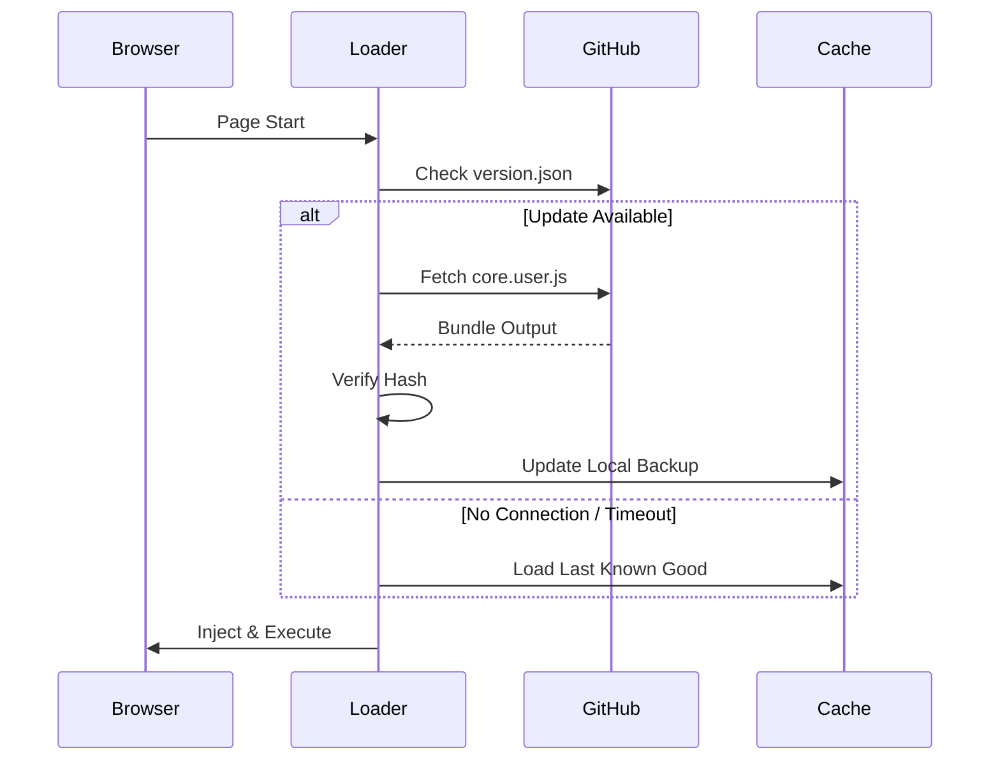

<div align="center">

<br>


<br>

# 🔧 Bintang Toba Pro — UserScript Suite

### *Precision-Engineered Browser Scripts for the Modern Web*

[](https://github.com/JD-YH03D)
[](https://greasyfork.org/id/users/1575724-qwerty-1)
[](https://raw.githubusercontent.com/JD-YH03D/Releases-Published/refs/heads/main/LICENSE)
[](#-available-scripts)
[](#)

---

*A curated collection of high-performance UserScripts built with reliability, efficiency, and user experience at the core. Designed for Tampermonkey, Violentmonkey, and Greasemonkey.*

<br>

[**Get Started**](#-quick-start) · [**Browse Scripts**](#-available-scripts) · [**Contribute**](#-contributing) · [**Report Bug**](https://github.com/JD-YH03D/release/issues)

---

</div>

<br>

## 📖 Table of Contents

<details>
<summary><b>Click to expand</b></summary>

<br>

- [About the Project](#-about-the-project)
- [Architecture & Design Philosophy](#-architecture--design-philosophy)
- [Quick Start](#-quick-start)
- [Available Scripts](#-available-scripts)
  - [GeoGuessr Suite](#-geoguessr--lets-explore-the-world)
  - [Chess.com Suite](#-chesscom--play-chess-online)
- [Compatibility Matrix](#-compatibility-matrix)
- [Changelog](#-changelog)
- [Roadmap](#-roadmap)
- [Contributing](#-contributing)
- [Security](#-security)
- [License](#-license)
- [Acknowledgments](#-acknowledgments)
- [Contact](#-contact)

</details>

<br>

---

## 🎯 About the Project

**Bintang Toba Pro** is a professional-grade UserScript development initiative focused on delivering **robust**, **well-tested**, and **maintainable** browser enhancement scripts for widely-used web platforms.

Every script in this repository follows strict engineering principles:

```
📐 Clean Architecture    →  Modular, readable, and maintainable code
🧪 Tested & Verified     →  Cross-browser validation before every release
⚡ Performance First     →  Minimal DOM overhead, zero memory leaks
🔒 Security Conscious    →  No external data collection, no telemetry
📦 Semantic Versioning   →  Predictable, well-documented release cycles
```

<br>

---

## 🏗 Architecture & Design Philosophy

<div align="center">



```
┌─────────────────────────────────────────────────────┐
│                  BINTANG TOBA PRO                   │
│               UserScript Framework                  │
├─────────────────────────────────────────────────────┤
│                                                     │
│   ┌──────────┐  ┌──────────┐  ┌──────────────┐      │
│   │  Script  │  │  Script  │  │   Script     │      │
│   │  Loader  │→ │  Engine  │→ │  Interface   │      │
│   └──────────┘  └──────────┘  └──────────────┘      │
│        ↓              ↓              ↓              │
│   ┌──────────────────────────────────────────┐      │
│   │        Core Utility Library              │      │
│   │  ┌────────┐ ┌────────┐ ┌────────────┐    │      │
│   │  │  DOM   │ │ Event  │ │  Storage   │    │      │
│   │  │ Helper │ │ Manager│ │  Manager   │    │      │
│   │  └────────┘ └────────┘ └────────────┘    │      │
│   └──────────────────────────────────────────┘      │
│                                                     │
└─────────────────────────────────────────────────────┘
```

</div>

<br>

| Principle | Implementation |
|:----------|:---------------|
| **Separation of Concerns** | Each module handles a single responsibility |
| **Fail-Safe Execution** | Graceful degradation when target DOM changes |
| **Zero Dependencies** | Pure vanilla JS — no external libraries required |
| **Non-Invasive** | Scripts inject cleanly without breaking host sites |
| **Version Controlled** | Every release is tagged, documented, and reversible |

<br>

---

## ⚡ Quick Start

### Prerequisites

You need **one** of the following UserScript managers installed in your browser:

<div align="center">

| Manager | Browser Support | Recommended | Download |
|:--------|:---------------|:----------:|:---------|
| **Tampermonkey** | Chrome, Firefox, Edge, Safari, Opera | ✅ | [Install →](https://www.tampermonkey.net/) |
| **Violentmonkey** | Chrome, Firefox, Edge | ⬜ | [Install →](https://violentmonkey.github.io/) |
| **Greasemonkey** | Firefox | ⬜ | [Install →](https://www.greasespot.net/) |

</div>

### Installation Steps

```bash
# Step 1: Install a UserScript manager (Tampermonkey recommended)
# Step 2: Click any "Install" link from the scripts table below
# Step 3: Confirm installation in the popup dialog
# Step 4: Navigate to the target website — the script activates automatically
```

> [!TIP]
> **Tampermonkey** is recommended for the best compatibility and performance across all scripts in this collection.

<br>

---

## 📦 Available Scripts

<br>

### 🌍 GeoGuessr — Let's Explore the World

<div align="center">


<br><br>

> *Advanced enhancement suite for GeoGuessr — providing intelligent tools and UI improvements to elevate your gameplay experience.*

</div>

<br>

<div align="center">

| Version | Status | Release Date | Size | Installation |
|:--------|:------:|:------------|:----:|:-------------|
| `v1.7.1` |  | 2024 | ~45 KB | [**⬇ Install v1.7.1**](https://raw.githubusercontent.com/JD-YH03D/release/refs/heads/main/GeoGuessr%20-%20Let's%20explore%20the%20world!/version1.7.1-release.js) |
| `v1.8.0` |  | 2024 | ~52 KB | [**⬇ Install v1.8.0**](https://raw.githubusercontent.com/JD-YH03D/release/refs/heads/main/GeoGuessr%20-%20Let's%20explore%20the%20world!/version1.8.0-release.js) |

</div>

<details>
<summary><b>📋 Version 1.8.0 — Release Notes</b></summary>

<br>

**What's New:**
- 🆕 Enhanced UI component rendering
- ⚡ Performance optimizations for map interactions
- 🛡 Improved stability and error handling
- 🐛 Bug fixes from community feedback

**Upgrade Path:**
> If upgrading from `v1.7.x`, simply install `v1.8.0` — it will automatically replace the previous version.

</details>

<br>

---

### ♟ Chess.com — Play Chess Online

<div align="center">


<br><br>

> *Feature-rich enhancement script for Chess.com — delivering refined tools and interface improvements for a superior chess experience.*

</div>

<br>

<div align="center">

| Version | Status | Release Date | Size | Installation |
|:--------|:------:|:------------|:----:|:-------------|
| `v1.0.0` |  | 2024 | ~38 KB | [**⬇ Install v1.0.0**](https://raw.githubusercontent.com/JD-YH03D/release/refs/heads/main/Chess.com%20-%20Play%20Chess%20Online%20-%20Free%20Games/version1.0.0-release.js) |

</div>

<details>
<summary><b>📋 Version 1.0.0 — Release Notes</b></summary>

<br>

**Initial Release Features:**
- 🎯 Core enhancement engine
- 🎨 Clean, non-intrusive UI overlay
- ⚙ Configurable settings panel
- 📱 Responsive design support

</details>

<br>

---

## 🔄 Compatibility Matrix

<div align="center">

| Script | Chrome | Firefox | Edge | Safari | Opera |
|:-------|:------:|:-------:|:----:|:------:|:-----:|
| GeoGuessr v1.7.1 | ✅ | ✅ | ✅ | ⚠️ | ✅ |
| GeoGuessr v1.8.0 | ✅ | ✅ | ✅ | ⚠️ | ✅ |
| Chess.com v1.0.0 | ✅ | ✅ | ✅ | ⚠️ | ✅ |

</div>

> ⚠️ **Safari**: Limited support due to WebKit restrictions on UserScript injection. Use Tampermonkey for Safari for best results.

<br>

---

## 📋 Changelog

> Full changelog available in [CHANGELOG.md](CHANGELOG.md)

```
[1.8.0] - 2024
  ├── Added    → Enhanced rendering pipeline for GeoGuessr
  ├── Changed  → Optimized DOM observer performance
  ├── Fixed    → Memory leak in event listener cleanup
  └── Security → Updated CSP compliance headers

[1.7.1] - 2024
  ├── Added    → Initial GeoGuessr feature set
  ├── Added    → Settings persistence via GM_storage
  └── Fixed    → Cross-origin iframe detection

[1.0.0] - 2024
  ├── Added    → Chess.com initial release
  ├── Added    → Core analysis engine
  └── Added    → Configuration panel UI
```

<br>

---

## 🗺 Roadmap

<div align="center">

```
  Q1 2025       Q2 2025        Q3 2025        Q4 2025
    │              │              │              │
    ▼              ▼              ▼              ▼
┌────────┐     ┌────────┐     ┌────────┐     ┌────────┐
│ v2.0.0 │     │ v2.1.0 │     │ New    │     │ v3.0.0 │
│ GeoGu- │────→│ Chess  │────→│ Script │────→│ Major  │
│ esssr  │     │ Update │     │ Launch │     │ Rewrite│
└────────┘     └────────┘     └────────┘     └────────┘
```

</div>

- [ ] 🌍 GeoGuessr v2.0.0 — Complete UI redesign with dark mode
- [ ] ♟ Chess.com v1.1.0 — Advanced analysis features
- [ ] 🆕 New platform scripts (TBD based on community requests)
- [ ] 📚 Comprehensive API documentation
- [ ] 🧪 Automated testing pipeline

<br>

---

## 🤝 Contributing

Contributions make the open-source community an incredible place to learn, inspire, and create. **Any contribution you make is greatly appreciated.**

### How to Contribute

```bash
# 1. Fork the repository
gh repo fork JD-YH03D/release

# 2. Create your feature branch
git checkout -b feature/amazing-feature

# 3. Commit your changes
git commit -m "feat: add amazing feature"

# 4. Push to the branch
git push origin feature/amazing-feature

# 5. Open a Pull Request
```

### Contribution Guidelines

| Type | Description |
|:-----|:------------|
| 🐛 **Bug Report** | Open an [issue](https://github.com/JD-YH03D/release/issues) with detailed reproduction steps |
| 💡 **Feature Request** | Describe the feature and its use case in an issue |
| 📝 **Documentation** | Fix typos, improve explanations, add examples |
| 🔧 **Code** | Follow existing code style, include comments |

> Please read [CONTRIBUTING.md](CONTRIBUTING.md) for our full code of conduct and development guidelines.

<br>

---

## 🔒 Security

> [!IMPORTANT]
> **All scripts in this repository are open-source and auditable.** No data is collected, transmitted, or stored on external servers. All storage is local via the UserScript manager's `GM_setValue`/`GM_getValue` API.

If you discover a security vulnerability, please report it responsibly:
- 📧 Open a private [security advisory](https://github.com/JD-YH03D/release/security/advisories)
- ❌ Do **not** open public issues for security vulnerabilities

<br>

---

## 📜 License

<div align="center">

Distributed under the **MIT License**.

```
MIT License

Copyright (c) 2024 Bintang Toba Pro (JD-YH03D)

Permission is hereby granted, free of charge, to any person obtaining a copy
of this software and associated documentation files (the "Software"), to deal
in the Software without restriction, including without limitation the rights
to use, copy, modify, merge, publish, distribute, sublicense, and/or sell
copies of the Software, and to permit persons to whom the Software is
furnished to do so, subject to the following conditions:

The above copyright notice and this permission notice shall be included in all
copies or substantial portions of the Software.
```

See [`LICENSE`](LICENSE) for full details.

</div>

<br>

---

## 🙏 Acknowledgments

- [Tampermonkey](https://www.tampermonkey.net/) — Best-in-class UserScript manager
- [Greasy Fork](https://greasyfork.org/) — Trusted script hosting platform
- [Shields.io](https://shields.io/) — Beautiful badge generation
- The open-source community for continuous inspiration

<br>

---

## 📬 Contact

<div align="center">

| Platform | Link |
|:---------|:-----|
| 🐙 **GitHub** | [github.com/JD-YH03D](https://github.com/JD-YH03D) |
| 📜 **Greasy Fork** | [Bintang Toba Pro Profile](https://greasyfork.org/id/users/1575724-qwerty-1) |
| 🐛 **Issues** | [Bug Tracker](https://github.com/JD-YH03D/release/issues) |

<br>

---

<br>


**Bintang Toba Pro** — *Crafted with precision. Built for performance.*

<br>


<br>

⭐ **Star this repository if you find it useful!** ⭐

</div>
